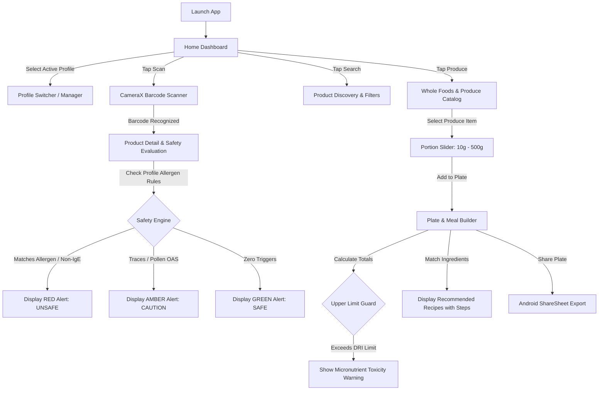

# 🥗 KYF (Know Your Food) — Complete Application & Architecture Guide

> **Know Your Food (KYF)** is a production-grade, offline-first, native Android application engineered for **x64 and ARM64** architectures. It combines real-time computer vision barcode scanning, multi-profile allergen guarding, UK/EU front-of-pack traffic light nutrition analytics, and an interactive whole-food meal planner powered by normalized **USDA and INDB (Indian Food Composition Tables)** datasets.

---

## 📑 Table of Contents
1. [Executive Summary & Tech Stack](#1-executive-summary--tech-stack)
2. [Application Architecture & Offline-First Design](#2-application-architecture--offline-first-design)
3. [Core Functional Modules](#3-core-functional-modules)
   - [Module A: Family & Health Profile Management](#module-a-family--health-profile-management)
   - [Module B: Barcode Scanner & Safety Assessment Engine](#module-b-barcode-scanner--safety-assessment-engine)
   - [Module C: Smart Product Discovery & Search](#module-c-smart-product-discovery--search)
   - [Module D: Global Produce & Whole Foods Explorer](#module-d-global-produce--whole-foods-explorer)
   - [Module E: Plate Builder & UL Nutritional Analyzer](#module-e-plate-builder--ul-nutritional-analyzer)
4. [Scientific & Regulatory Logic Engines](#4-scientific--regulatory-logic-engines)
   - [Allergy & Safety Evaluation Engine](#allergy--safety-evaluation-engine)
   - [UK/EU Front-of-Pack Traffic Light Engine](#ukeu-front-of-pack-traffic-light-engine)
   - [Nutri-Score Grade Classification](#nutri-score-grade-classification)
   - [Tolerable Upper Limit (UL) Safety Guard](#tolerable-upper-limit-ul-safety-guard)
5. [Database Schema & Data Normalization](#5-database-schema--data-normalization)
6. [Design System & UI Aesthetics](#6-design-system--ui-aesthetics)
7. [App User Journey & Workflow Diagrams](#7-app-user-journey--workflow-diagrams)

---

## 1. Executive Summary & Tech Stack

KYF eliminates guesswork in grocery shopping and meal preparation by placing an intelligent, personalized nutritional guardian into the user's pocket. It works **100% offline**, guaranteeing zero network latency, full data privacy, and reliability in grocery stores with poor cellular reception.

```
┌─────────────────────────────────────────────────────────────────────────┐
│                           KYF TECH STACK                                │
├──────────────────────────┬──────────────────────────────────────────────┤
│ Language & Runtime       │ Kotlin 1.9.22 / JDK 17 (Target SDK 34)       │
│ UI Toolkit               │ Jetpack Compose (Material 3 + Glassmorphism) │
│ Architecture             │ Unidirectional Data Flow (MVVM)              │
│ Local Database           │ Room SQLite with Prepackaged Datasets        │
│ Camera & Vision          │ CameraX 1.3.1 + Google ML Kit Barcode Vision │
│ Reactive Programming     │ Kotlin Coroutines & StateFlow (Debounced)    │
│ Serialization            │ Kotlinx Serialization (JSON)                 │
└──────────────────────────┴──────────────────────────────────────────────┘
```

---

## 2. Application Architecture & Offline-First Design

KYF follows clean architecture principles separated into three distinct layers:

```
┌────────────────────────────────────────────────────────────────────────┐
│                        PRESENTATION LAYER (UI)                         │
│  Compose Screens • GlassmorphicCard • SafetyAlertBanner • FlowRow Tags │
└───────────────────────────────────▲────────────────────────────────────┘
                                    │ UI StateFlow / User Events
┌───────────────────────────────────▼────────────────────────────────────┐
│                           VIEWMODEL LAYER                              │
│  StateFlow • 300ms Debounce Query Flow • ViewModel Scope Coroutines    │
└───────────────────────────────────▲────────────────────────────────────┘
                                    │ Use-Cases & Engine Calls
┌───────────────────────────────────▼────────────────────────────────────┐
│                    DOMAIN / BUSINESS LOGIC LAYER                       │
│  • AllergyEngine (FDA 9 / EU 14 / FSSAI 8 / OAS / Non-IgE / Pediatrics)│
│  • SafetyRecommendationEngine (UK/EU Traffic Lights & Nutri-Score)     │
│  • NutrientCalculator (Portion Scaling & UL Limits Check)              │
└───────────────────────────────────▲────────────────────────────────────┘
                                    │ Repository Abstractions
┌───────────────────────────────────▼────────────────────────────────────┐
│                          DATA LAYER (OFFLINE)                          │
│  • Room SQLite AppDatabase (Prepackaged `nutrition_app.db`)            │
│  • ProductsDao • ProduceDao • ProfileDao • PlateDao                    │
└────────────────────────────────────────────────────────────────────────┘
```

---

## 3. Core Functional Modules

### Module A: Family & Health Profile Management
* **Multi-User Profile Switching**: Store individual profiles for every household member (e.g., Self, Child, Spouse, Elderly Parent) with custom metrics: Name, Age, Gender, Weight, and Height.
* **Global Regulatory Allergen Checklists**:
  - **FDA 9**: Milk, Eggs, Fish, Crustacean Shellfish, Tree Nuts, Peanuts, Wheat, Soybeans, Sesame.
  - **EU 14**: Adds Celery, Mustard, Lupin, Molluscs, Sulphur dioxide/Sulphites.
  - **FSSAI 8**: Indian statutory major allergen standards.
* **Pollen-Food Cross-Reactivity (Oral Allergy Syndrome - OAS)**:
  - Birch Pollen (Apples, Pears, Peaches, Carrots, Hazelnuts).
  - Grass Pollen (Melons, Tomatoes, Oranges).
  - Ragweed Pollen (Bananas, Melons, Zucchini, Cucumbers).
  - Mugwort Pollen (Celery, Carrots, Spices).
  - Latex-Fruit Syndrome (Avocado, Banana, Chestnut, Kiwi).
* **Non-IgE & Special Dietary Conditions**:
  - **Celiac Disease**: Zero tolerance for wheat, rye, barley, spelt, kamut, malt.
  - **FPIES** (Food Protein-Induced Enterocolitis Syndrome): Flags rice, oats, soy, cow's milk for infants.
  - **Eosinophilic Esophagitis (EoE)**: Tracks common 6-food elimination triggers.
  - **Histamine Intolerance**: Flags aged, fermented, or cured ingredients.
  - **Alpha-Gal Syndrome**: Red meat allergy from tick bites (flags mammalian meats, gelatin, lard).
* **Strict Trace Mode**: Toggleable option to treat *"May contain traces of..."* with the same strict severity as explicit ingredient contents.

---

### Module B: Barcode Scanner & Safety Assessment Engine
* **Instant Vision Scanning**: Uses CameraX and Google ML Kit to scan EAN-13, EAN-8, UPC-A, and UPC-E barcodes within milliseconds.
* **Smart Camera Viewfinder**:
  - Soft green target reticle with dynamic ambient brightness gradient overlays.
  - Graceful fallback for non-camera or emulator environments.
* **Interactive Scan Results Modal**:
  - **Personalized Safety Banner**: Instant color-coded rating (`SAFE` in Green, `CAUTION` in Amber, `UNSAFE` in Red).
  - **Traffic Light Indicators**: Individual front-of-pack bars for Fat, Saturated Fat, Sugar, and Salt.
  - **Nutri-Score Grade**: Official A, B, C, D, E badge.
* **Collapsible Quick Lookup**: Quick access drawer allowing instant inspection of preloaded sample items without requiring a physical barcode.
* **Manual Input Dialog**: Direct numeric barcode entry for damaged or non-scannable labels.

---

### Module C: Smart Product Discovery & Search
* **Zero-Lag Search with 300ms Debounce**: Allows responsive typing while asynchronously querying the local SQLite database without UI frame drops.
* **Multi-Dimensional Quick Filtering**:
  - **Nutri-Score filter**: `A`, `B`, `C`, `D`, `E`.
  - **Nutrition Thresholds**: High Protein (≥10g), Low Sugar (≤5g), Low Salt (≤0.3g).
  - **Allergen-Free Filters**: Gluten-Free, Dairy-Free, Peanut-Free (cross-referenced against deep ingredient token dictionaries).
* **Product Detail Deep-Dive**:
  - Complete ingredients list with bold allergen declarations.
  - Full nutritional table per 100g (Calories, Energy in kJ, Fats, Saturates, Sugars, Fiber, Protein, Salt).
  - **Smart Healthier Swaps**: Suggests lower-sugar or higher-Nutri-Score alternatives within the exact same product category.

---

### Module D: Global Produce & Whole Foods Explorer
* **Authoritative Dual Database Sourcing**:
  - **USDA Foundation & SR Legacy**: Normalized raw produce from the United States Department of Agriculture.
  - **INDB 2024 (Indian Food Composition Tables)**: Comprehensive data for regional lentils, legumes, millets, and tropical produce.
* **Nutrient Target Filters**:
  - **Iron-Rich**: Produce with ≥ 2.5mg Iron (e.g., Spinach, Lentils).
  - **Vitamin C-Rich**: Produce with ≥ 40mg Vitamin C (e.g., Guava, Bell Peppers, Oranges).
  - **High Fiber**: Produce with ≥ 5g Dietary Fiber (e.g., Chia Seeds, Beans).
  - **High Protein**: Whole foods with ≥ 8g Plant Protein (e.g., Chickpeas, Edamame).
  - **Low Potassium**: Safe produce with ≤ 200mg Potassium (for renal diet management).
  - **Low Calorie**: Volumetric produce with ≤ 40 kcal/100g.
* **Real-Time Portion Serving Slider**:
  - Slide between 10g and 500g with instant real-time scaling of calories, macros, and micro-nutrients.

---

### Module E: Plate Builder & UL Nutritional Analyzer
* **Interactive Meal Assembly**: Add multiple whole foods and produce items directly to the active profile's plate.
* **Aggregated Nutrient Totals**: Calculates combined Calories, Protein, Net Carbs, Fiber, Iron, Vitamin C, Potassium, and Calcium.
* **Tolerable Upper Limit (UL) Safety Warnings**:
  - Triggers alerts if cumulative micronutrient intake exceeds established safe limits.
* **Smart Dynamic Recipe Engine**:
  - Analyzes ingredients currently on the plate and recommends recipes that can be made immediately.
  - Includes cooking preparation time, matched ingredient checklist, and step-by-step instructions.
* **Plate Summary Sharing**: Native Android ShareSheet export to share formatted nutritional logs with nutritionists, family, or fitness apps.

---

## 4. Scientific & Regulatory Logic Engines

### Allergy & Safety Evaluation Engine
When evaluating a product or whole food against a user's active profile, `AllergyEngine` executes a 5-tier safety check:

$$\text{Safety Assessment} = f(\text{Direct Allergens}, \text{Trace Rules}, \text{Pollen OAS}, \text{Non-IgE Conditions}, \text{Pediatric Rules})$$

1. **Direct Ingredient Conflict**: Matches profile allergen tokens against product `allergens_json` and tokenized `ingredients_text`. (Result $\rightarrow$ `UNSAFE`)
2. **Trace / Precautionary Conflict**: Evaluates `may_contain` tags against user allergens. If **Strict Trace Mode** is enabled $\rightarrow$ `UNSAFE`; otherwise $\rightarrow$ `CAUTION`.
3. **Pollen-Food Cross-Reactivity**: Checks if produce/ingredients trigger sensitized Oral Allergy Syndromes (e.g., Birch $\rightarrow$ Raw Apple). (Result $\rightarrow$ `CAUTION`)
4. **Special Non-IgE Conditions**: Celiac (Gluten detection), FPIES (Infant trigger proteins), Alpha-Gal (Mammalian gelatin/fats). (Result $\rightarrow$ `UNSAFE`)
5. **Pediatric Guardrails**:
   - **Age < 1 year**: Flags **Honey** (Infant Botulism risk) and high sodium (>0.4g/100g).
   - **Age < 2 years**: Flags **Added Sugars** (>0g/100g) and whole nuts (choking hazard).
   - **Age < 12 years**: Flags products with **High Sugar** (>22.5g/100g) or **Caffeine / Energy stimulants**.

---

### UK/EU Front-of-Pack Traffic Light Engine
Implemented strictly in accordance with UK Food Standards Agency (FSA) and EU Regulation 1169/2011 per 100g:

| Nutrient | Green (Low) | Amber (Medium) | Red (High) |
| :--- | :--- | :--- | :--- |
| **Total Fat** | $\le 3.0\text{ g}$ | $> 3.0\text{ g}$ to $\le 17.5\text{ g}$ | $> 17.5\text{ g}$ |
| **Saturated Fat** | $\le 1.5\text{ g}$ | $> 1.5\text{ g}$ to $\le 5.0\text{ g}$ | $> 5.0\text{ g}$ |
| **Total Sugars** | $\le 5.0\text{ g}$ | $> 5.0\text{ g}$ to $\le 22.5\text{ g}$ | $> 22.5\text{ g}$ |
| **Salt** | $\le 0.3\text{ g}$ | $> 0.3\text{ g}$ to $\le 1.5\text{ g}$ | $> 1.5\text{ g}$ |

---

### Nutri-Score Grade Classification
Evaluates negative points ($N$: Energy, Sugars, Saturated Fatty Acids, Sodium) and positive points ($P$: Fruits/Vegetables/Nuts %, Fiber, Protein):

$$\text{Nutri-Score Score} = N - P$$

- **Grade A (Green)**: Score $\le -1$ (Highest nutritional density)
- **Grade B (Light Green)**: Score $0 \text{ to } 2$
- **Grade C (Yellow)**: Score $3 \text{ to } 10$
- **Grade D (Orange)**: Score $11 \text{ to } 18$
- **Grade E (Red)**: Score $\ge 19$ (High ultra-processed / sugar / salt density)

---

### Tolerable Upper Limit (UL) Safety Guard
Aggregated plate micronutrients are checked against National Academies Food and Nutrition Board Dietary Reference Intakes (DRI):

- **Iron (Fe)**: UL = $45.0\text{ mg/day}$ (Flags toxicity / gastrointestinal stress risk)
- **Vitamin C**: UL = $2000.0\text{ mg/day}$ (Flags osmotic diarrhea / kidney stone risk)
- **Potassium (K)**: Warning threshold = $4700.0\text{ mg/day}$ (Hyperkalemia safeguard)
- **Calcium (Ca)**: UL = $2500.0\text{ mg/day}$ (Hypercalcemia safeguard)

---

## 5. Database Schema & Data Normalization

The prepackaged SQLite database `nutrition_app.db` utilizes Room ORM with 4 core tables:

```sql
-- 1. Packaged Consumer Products Table
CREATE TABLE products (
    barcode TEXT PRIMARY KEY NOT NULL,
    name TEXT NOT NULL,
    brand TEXT NOT NULL,
    category TEXT NOT NULL,
    nutri_score TEXT NOT NULL,
    sugars_100g REAL NOT NULL,
    fat_100g REAL NOT NULL,
    sat_fat_100g REAL NOT NULL,
    salt_100g REAL NOT NULL,
    protein_100g REAL NOT NULL,
    energy_kcal_100g REAL NOT NULL,
    fiber_100g REAL NOT NULL,
    ingredients_text TEXT NOT NULL,
    allergens_json TEXT NOT NULL,
    healthier_alternatives_json TEXT
);

-- 2. Raw Produce & Whole Foods Table
CREATE TABLE raw_foods (
    fdc_id INTEGER PRIMARY KEY NOT NULL,
    name TEXT NOT NULL,
    category TEXT NOT NULL,
    source TEXT NOT NULL,          -- 'USDA Foundation', 'USDA SR Legacy', 'INDB 2024'
    serving_g REAL NOT NULL,
    energy_kcal REAL NOT NULL,
    protein REAL NOT NULL,
    carbs REAL NOT NULL,
    fat REAL NOT NULL,
    fiber REAL NOT NULL,
    iron REAL NOT NULL,
    vit_c REAL NOT NULL,
    micronutrients_json TEXT NOT NULL
);

-- 3. Household Profiles Table
CREATE TABLE profiles (
    id INTEGER PRIMARY KEY AUTOINCREMENT NOT NULL,
    name TEXT NOT NULL,
    age INTEGER NOT NULL,
    gender TEXT NOT NULL,
    weight REAL NOT NULL,
    height REAL NOT NULL,
    allergies_json TEXT NOT NULL
);

-- 4. Active Plate Items Table
CREATE TABLE plate_items (
    id INTEGER PRIMARY KEY AUTOINCREMENT NOT NULL,
    profile_id INTEGER NOT NULL,
    food_id INTEGER NOT NULL,
    quantity_g REAL NOT NULL,
    FOREIGN KEY(profile_id) REFERENCES profiles(id) ON DELETE CASCADE,
    FOREIGN KEY(food_id) REFERENCES raw_foods(fdc_id) ON DELETE CASCADE
);
```

---

## 6. Design System & UI Aesthetics

* **Color Palette**:
  - `Slate950` (`#0B0F19`) & `Slate900` (`#0F172A`): Deep obsidian and dark slate surfaces.
  - `Emerald500` (`#10B981`) & `Emerald400` (`#34D399`): Primary branding, health indicators, and CTA accents.
  - `Cyan400` (`#22D3EE`): Produce and secondary macro accents.
  - `TrafficRed` (`#EF4444`), `TrafficYellow` (`#F59E0B`), `TrafficGreen` (`#10B981`): Regulatory traffic lights.
* **Component Architecture**:
  - `GlassmorphicCard`: Elevated dark cards with subtle alpha translucent borders (`0x22FFFFFF`).
  - `FlowRow Tag Badges`: Auto-wrapping chips that dynamically adapt to any screen width.
  - `Smooth Screen Transitions`: Horizontal slide ($x / 6$) and alpha fade ($200\text{ms}$) navigation.
  - `Edge-to-Edge System Bars`: Fully transparent status and navigation bars adapting to Android 12, 13, 14, and 15+.

---

## 7. App User Journey & Workflow Diagrams


