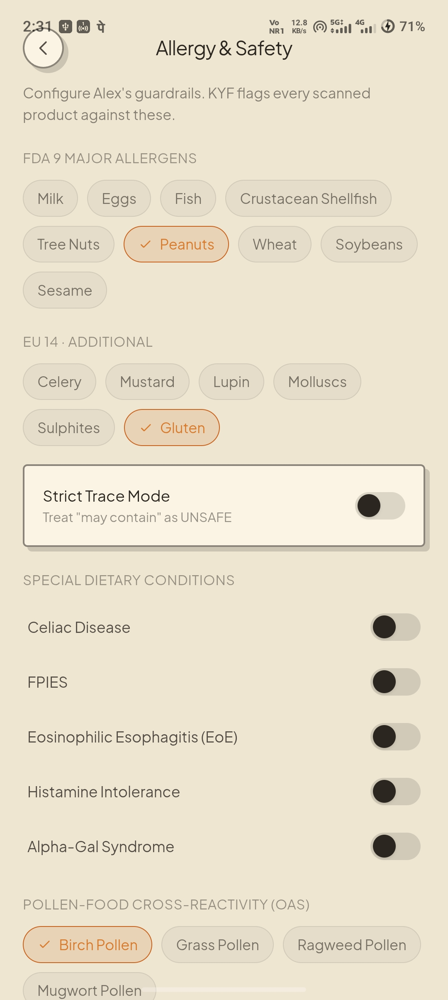
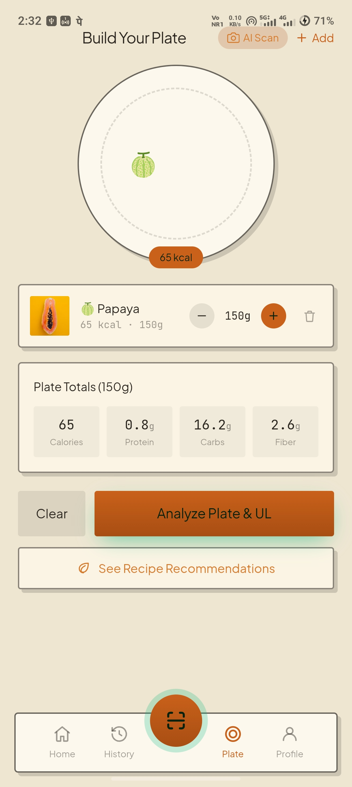
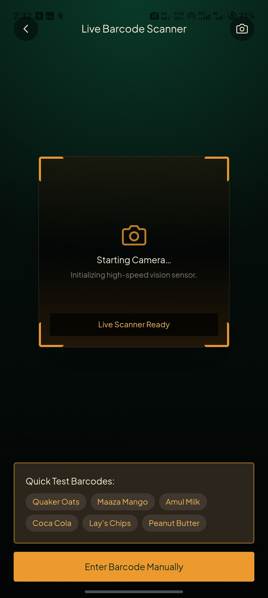
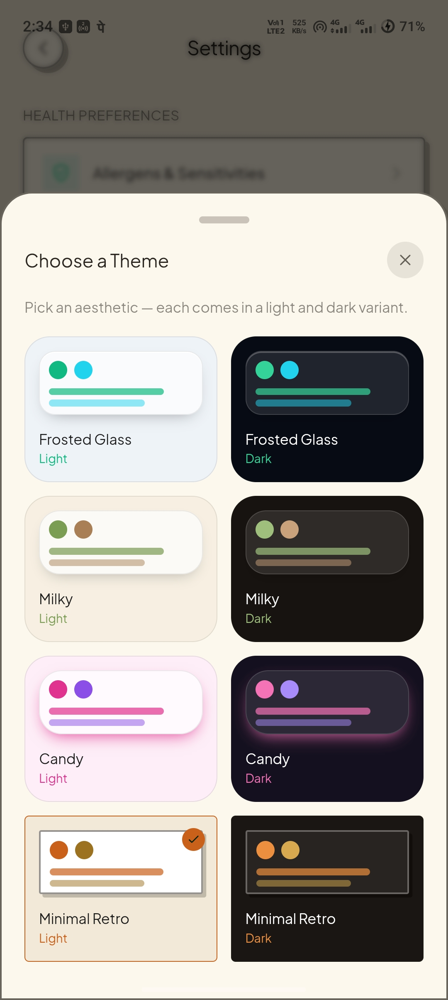
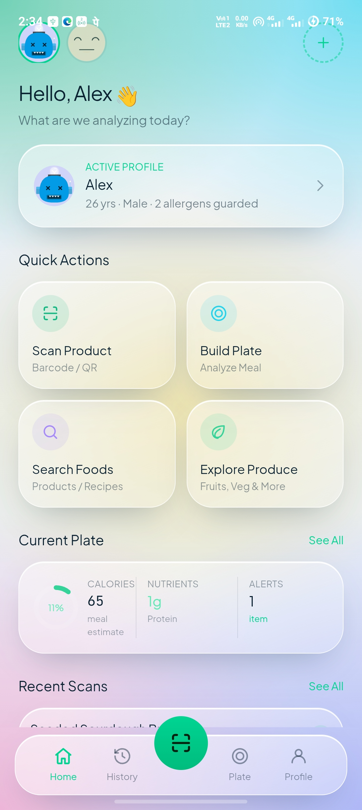

# 🥗 KYF (Know Your Food)

<div align="center">

**An open-source food scanner and nutrition assistant for Android**

[](https://github.com/QuorLum/KYF-Know-Your-Food)
[](https://github.com/QuorLum/KYF-Know-Your-Food/releases)
[](LICENSE)
[](https://kotlinlang.org)
[](https://react.dev)
[](https://tailwindcss.com)

[📱 Download APK](./release/KYF-KnowYourFood-v1.7.0.apk) • [📸 Screenshots](#-screenshots) • [✨ Features](#-features) • [🚀 Getting Started](#-getting-started)

</div>

---

## 📸 Screenshots

<div align="center">
<table>
  <tr>
    <td align="center" width="33%">
      <br/>
      <b>Home Dashboard (Retro Theme)</b>
    </td>
    <td align="center" width="33%">
      <br/>
      <b>Multi-User Family Profiles</b>
    </td>
    <td align="center" width="33%">
      <br/>
      <b>Allergy & Safety Setup</b>
    </td>
  </tr>
  <tr>
    <td align="center" width="33%">
      <br/>
      <b>Build Your Plate & AI Scan</b>
    </td>
    <td align="center" width="33%">
      <br/>
      <b>Live Barcode Scanner</b>
    </td>
    <td align="center" width="33%">
      <br/>
      <b>Explore Produce & Whole Foods</b>
    </td>
  </tr>
  <tr>
    <td align="center" width="33%">
      <br/>
      <b>Search (Best-to-Worst Ranking)</b>
    </td>
    <td align="center" width="33%">
      <br/>
      <b>Settings & Preferences</b>
    </td>
    <td align="center" width="33%">
      <br/>
      <b>8 Built-in Themes</b>
    </td>
  </tr>
  <tr>
    <td align="center" width="50%">
      <br/>
      <b>Theme: Candy Dark</b>
    </td>
    <td align="center" width="50%">
      <br/>
      <b>Theme: Frosted Glass</b>
    </td>
  </tr>
</table>
</div>

---

## 📖 About the App

**Know Your Food (KYF)** is an Android app for checking packaged food ingredients, scanning barcodes, and planning meals with whole foods.

It connects to OpenFoodFacts for packaged grocery items, includes a reference catalog of whole foods from USDA FoodData Central and the Indian Nutrient Databank (INDB 2024), and checks product ingredient lists against allergen profiles you configure for your household.

---

## ✨ Features

### 1. 🔍 Barcode Scanning & Product Search
- **Live Camera Scanner**: Scan barcodes (EAN-13, EAN-8, UPC-A, UPC-E, QR codes) to pull product details and nutrition info.
- **Search**: Search packaged items with automatic lookups via OpenFoodFacts.
- **Nutri-Score & Traffic Lights**: Displays standard UK/EU front-of-pack traffic lights (Fat, Saturated Fat, Sugar, Salt) and Nutri-Score grades ($A \rightarrow E$) when available.

### 2. 🛡️ Allergy & Ingredient Checking
- **Allergen Matching**: Flags ingredients matching selected allergens (Peanuts, Tree Nuts, Milk, Eggs, Wheat/Gluten, Soy, Fish, Shellfish, Sesame, Mustard, Celery, Sulphites, Lupin).
- **Trace Warnings**: Flags *"May contain"* statements with an optional Strict Trace Mode.
- **Pollen-Food Cross-Reactivity (OAS)**: Shows potential associations for Birch, Grass, Ragweed, Mugwort, and Latex.
- **Special Diets**: Basic checks for Gluten/Celiac, Alpha-Gal (mammalian meat/gelatin), Histamine, and Lactose.
- **Age-Based Flags**: Warns about Honey for infants (<1 yr), and flags high sugar/salt content for young children.

### 3. 🥗 Whole Foods & Produce Catalog
- Reference data for fruits, vegetables, grains, nuts, seeds, and lentils sourced from USDA FoodData Central and INDB 2024.
- Portion slider (10g to 500g) that scales calories, protein, carbs, fat, fiber, iron, vitamin C, potassium, and calcium.
- Nutrient filter tags (e.g. high protein, high fiber, iron-rich, vitamin C-rich).

### 4. 🍽️ Plate Meal Builder & Recipes
- Assemble meals by adding produce items and see combined calorie and nutrient totals.
- Displays basic daily Tolerable Upper Intake Level (UL) reference thresholds for select micronutrients (Iron, Vitamin C, Calcium).
- Suggests whole-food recipes based on items added to the plate.

### 5. 🤖 Optional Meal Photo Scanner (Gemini Vision)
- Users can optionally provide their own Google Gemini API key in Settings to analyze meal photos and estimate items on a plate.

### 6. 👨‍👩‍👧 Family Profiles & Theming
- Create multiple household profiles with individual allergen preferences.
- 8 built-in themes (Frosted Glass, Milky, Candy, Minimal Retro in light and dark variants).

---

## 🛠️ Tech Stack

- **Android Host**: Kotlin 1.9, Android SDK 34, AndroidX WebKit, CameraX / ML Kit, Room SQLite.
- **Frontend UI**: React 19, TypeScript, Tailwind CSS v4, Vite.
- **Data APIs**: OpenFoodFacts API, Google Gemini API (optional user-provided key).
- **Embedded Datasets**: USDA FoodData Central, INDB 2024.

---

## 🚀 Getting Started

### 📥 Download APK

Get the latest build directly:
👉 **[KYF-KnowYourFood-v1.7.0.apk](./release/KYF-KnowYourFood-v1.7.0.apk)**

---

### 💻 Build from Source

#### Prerequisites
- **Android Studio** Hedgehog or newer
- **JDK 17**
- **Node.js** 18+ and **npm**

#### Build Steps
```bash
# 1. Clone the repository
git clone https://github.com/QuorLum/KYF-Know-Your-Food.git
cd "KYF - Know Your Food"

# 2. Build the web assets
cd design_extracted
npm install
npm run build
cd ..

# 3. Copy web bundle into Android assets
powershell -Command "Copy-Item -Path 'design_extracted\dist\*' -Destination 'app\src\main\assets\' -Recurse -Force"

# 4. Build the Android app
./gradlew assembleDebug

# 5. Install onto connected Android device
adb install -r app/build/outputs/apk/debug/app-debug.apk
```

---

## ⚖️ Disclaimer

> [!IMPORTANT]
> **Know Your Food (KYF)** is an informational tool for looking up nutritional data and ingredient lists. It is not a medical device and cannot replace professional medical diagnosis, allergy testing, or dietary advice. Product recipes and packaging declarations can change without notice — always verify labels directly on physical packaging, especially for severe allergies.

---

## 📄 License

This project is licensed under the [Apache License 2.0](LICENSE).
