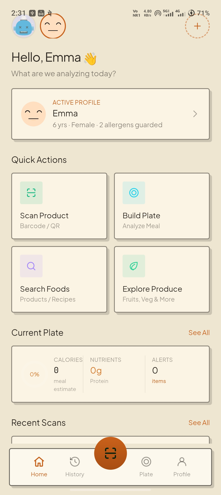
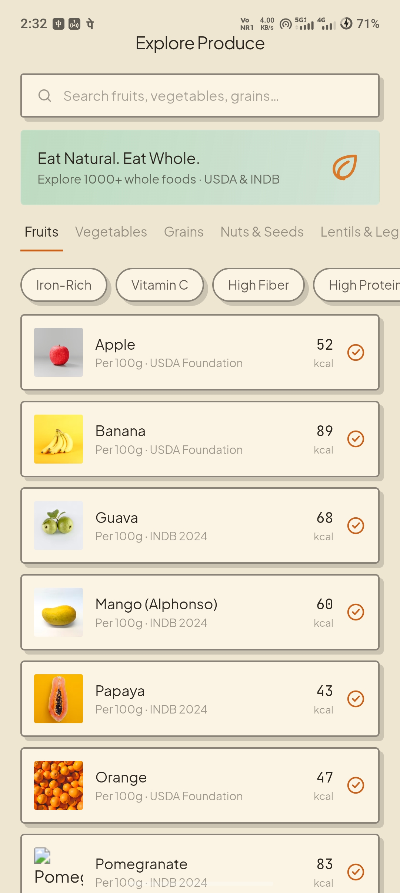
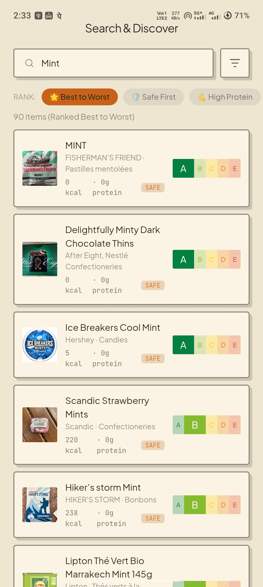
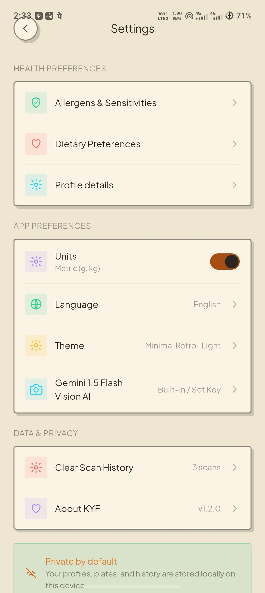
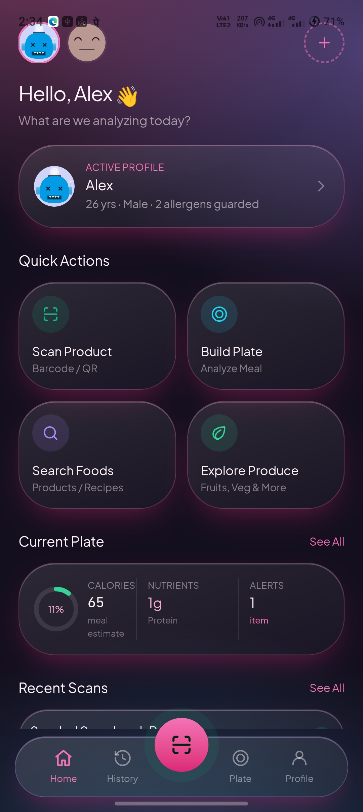
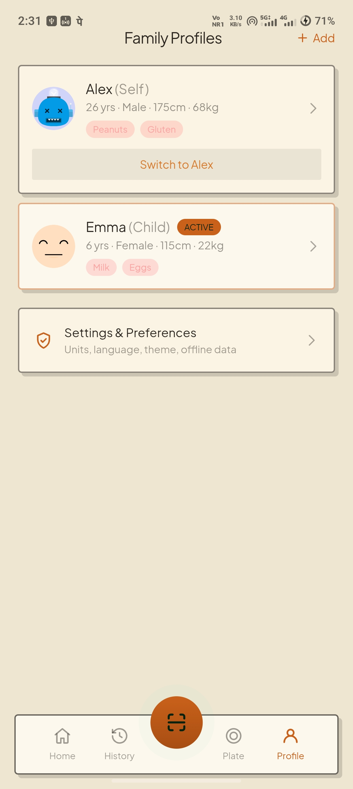

# 🥗 KYF (Know Your Food)

<div align="center">

**The Intelligent, Clinical-Grade Food Safety & Nutrition Guardian for Android**

[](https://github.com/QuorLum/KYF-Know-Your-Food)
[](https://github.com/QuorLum/KYF-Know-Your-Food/releases)
[](LICENSE)
[](https://kotlinlang.org)
[](https://react.dev)
[](https://tailwindcss.com)
[](https://ai.google.dev/)
[](https://world.openfoodfacts.org/)

[📱 Direct APK Download](./release/KYF-KnowYourFood-v1.7.0.apk) • [✨ Key Features](#-key-features) • [📸 Screenshots](#-app-screenshots) • [🧠 Clinical Engine](#-clinical-allergy--safety-engine) • [🚀 Getting Started](#-getting-started)

</div>

---

## 📸 App Screenshots

<div align="center">
<table>
  <tr>
    <td align="center" width="33%">
      <br/>
      <b>Home Dashboard & Health Snapshot</b>
    </td>
    <td align="center" width="33%">
      <br/>
      <b>Live Barcode Scanner</b>
    </td>
    <td align="center" width="33%">
      <br/>
      <b>Product Safety & Traffic Lights</b>
    </td>
  </tr>
  <tr>
    <td align="center" width="33%">
      <br/>
      <b>Unified Search (Best to Worst)</b>
    </td>
    <td align="center" width="33%">
      <br/>
      <b>USDA & INDB 2024 Produce</b>
    </td>
    <td align="center" width="33%">
      <br/>
      <b>Portion Scaling & Micronutrients</b>
    </td>
  </tr>
  <tr>
    <td align="center" width="33%">
      <br/>
      <b>Interactive Plate & UL Safety</b>
    </td>
    <td align="center" width="33%">
      <br/>
      <b>Gemini 1.5 Flash Meal Scanner</b>
    </td>
    <td align="center" width="33%">
      <br/>
      <b>Allergy & Safety Setup</b>
    </td>
  </tr>
  <tr>
    <td align="center" width="33%">
      <br/>
      <b>Multi-User Family Profiles</b>
    </td>
    <td align="center" width="33%">
      <br/>
      <b>Custom Avatars & Photo Upload</b>
    </td>
    <td align="center" width="33%">
      <br/>
      <b>Whole-Food Healing Recipes</b>
    </td>
  </tr>
</table>
</div>

---

## 🌟 Executive Overview

**Know Your Food (KYF)** is a high-performance Android application engineered to eliminate guesswork in grocery shopping and meal preparation. It places a personalized, clinical-grade nutritional guardian into the user's pocket.

KYF combines real-time camera vision barcode scanning, multi-profile allergen guarding, UK/EU front-of-pack traffic light nutrition analytics, Gemini 1.5 Flash Vision AI plate meal itemization, and an interactive whole-food meal planner powered by normalized **USDA and INDB 2024 (Indian Nutrient Databank)** datasets.

---

## ✨ Key Features

### 1. 🌐 Global OpenFoodFacts Live Sync
- **Live Barcode Scanning**: Scan any EAN-13, EAN-8, UPC-A, UPC-E, QR Code, or Code 128 barcode to fetch real-time ingredients, Nutri-Scores, allergens, and macronutrient breakdowns.
- **Zero-Click Unified Auto-Search**: Type any food, brand, or grocery term. The app searches local items and automatically queries the global database (3M+ items) in the background.
- **Always Ranked "Best to Worst"**: Products are sorted by safety for the active user, Nutri-Score grade ($A \rightarrow E$), and lower sugar/fat density.

### 2. 🤖 Gemini 1.5 Flash Vision AI Plate Scanner
- **Meal Photo Recognition**: Snap a photo of any cooked meal or plate directly from your camera or gallery.
- **AI Itemization & Portion Estimation**: Identifies individual food components, estimates portion weights in grams, and computes calories, protein, carbs, fat, fiber, iron, and vitamin C.
- **One-Tap Plate Loading**: Instantly adds identified meal items onto your interactive plate builder.

### 3. 🛡️ 5-Tier Clinical Allergy & Health Evaluation Engine
Evaluates every product and whole food against the active family member's clinical profile:
- **19 Regulated Major Allergens**: Peanut, Tree Nuts, Almond, Hazelnut, Milk/Dairy, Egg, Wheat/Gluten, Barley, Oats, Soybeans, Fish, Crustaceans, Molluscs, Sesame, Celery, Mustard, Sulphites, Lupin with synonym dictionary and regex word-boundary matching.
- **Precautionary Trace Alerts**: Facility warning detection (*"May contain traces of..."*) with toggleable **Strict Trace Mode**.
- **Pollen-Food Cross-Reactivity (Oral Allergy Syndrome - OAS)**: Birch, Grass, Ragweed, Mugwort, and Latex cross-reactivity mapping.
- **Non-IgE & Chronic Dietary Triggers**: Celiac Disease (zero-tolerance gluten tokens), Alpha-Gal Syndrome (mammalian meat/gelatin), Histamine Intolerance (aged/fermented foods), FPIES, and Lactose intolerance.
- **Pediatric Guardrails**:
  - **Age < 1 yr**: Flags Honey (Infant botulism risk) and high sodium.
  - **Age < 2 yrs**: Flags Added Sugars and choking hazards.
  - **Age < 12 yrs**: Flags High Sugar and energy/caffeine stimulants.

### 4. 🚦 UK/EU Front-of-Pack Traffic Lights & Nutri-Score
- **Regulatory Color Codes** (UK Food Standards Agency & EU Regulation 1169/2011):
  - **Total Fat**: 🟢 $\le 3.0\text{g}$ | 🟡 $3.0 - 17.5\text{g}$ | 🔴 $> 17.5\text{g}$
  - **Saturated Fat**: 🟢 $\le 1.5\text{g}$ | 🟡 $1.5 - 5.0\text{g}$ | 🔴 $> 5.0\text{g}$
  - **Total Sugars**: 🟢 $\le 5.0\text{g}$ | 🟡 $5.0 - 22.5\text{g}$ | 🔴 $> 22.5\text{g}$
  - **Salt**: 🟢 $\le 0.3\text{g}$ | 🟡 $0.3 - 1.5\text{g}$ | 🔴 $> 1.5\text{g}$
- **Official Nutri-Score Badging**: Calculated grades from $A$ (highest nutritional density) to $E$ (ultra-processed / high sugar & salt).

### 5. 🥗 USDA & INDB 2024 Produce Catalog
- **Dual Authoritative Datasets**:
  - **USDA FoodData Central**: Foundation Foods & SR Legacy reference set.
  - **INDB 2024 (Indian Nutrient Databank)**: Comprehensive Indian lentils, legumes, millets, and tropical produce.
- **Real-Time Serving Slider**: Scale portions from 10g to 500g with instant dynamic calculation of micro and macronutrients.
- **Targeted Nutrient Filters**: Iron-Rich ($\ge 2.5\text{mg}$), Vitamin C-Rich ($\ge 40\text{mg}$), High Fiber ($\ge 5\text{g}$), High Protein ($\ge 8\text{g}$), Low Potassium ($\le 200\text{mg}$), and Low Calorie ($\le 40\text{ kcal}$).

### 6. 🍲 Whole-Food Healing Recipes
- Match ingredients on your active plate against healthy, nutrient-rich recipes.
- Detailed prep times, step-by-step instructions, and a one-tap **"Add Ingredients to Plate"** button.

### 7. ⚡ Native Android Hardware Integration (`window.Android`)
- **Haptic Vibration**: Native physical vibration pulse on successful barcode scan.
- **Native Photo Picker**: Full `FileProvider` camera and gallery integration for meal and avatar capture.
- **Hardware Back Navigation**: Tapping Android back button or using back gestures smoothly pops sub-screens without closing the app.
- **Native ShareSheet**: Export formatted plate nutritional summaries to nutritionists, family, or health apps.

---

## 🏗️ Technical Architecture

```
┌────────────────────────────────────────────────────────────────────────┐
│                        PRESENTATION LAYER (UI)                         │
│  React 19 + Tailwind v4 • Glassmorphic Dark UI • 8 Dynamic Themes      │
└───────────────────────────────────▲────────────────────────────────────┘
                                    │ Android JavaScript Bridge (window.Android)
┌───────────────────────────────────▼────────────────────────────────────┐
│                       NATIVE ANDROID HOST (KOTLIN)                     │
│  • MainActivity.kt • WebViewAssetLoader • Hardware CameraX & ML Kit   │
│  • WindowInsetsController (Native System Bar Sync) • FileProvider      │
└───────────────────────────────────▲────────────────────────────────────┘
                                    │ Clinical Rules & API Services
┌───────────────────────────────────▼────────────────────────────────────┐
│                    DOMAIN / BUSINESS LOGIC LAYER                       │
│  • AllergyEngine (FDA 9 / EU 14 / FSSAI 8 / OAS / Non-IgE / Pediatrics)│
│  • TrafficLight & NutriScore Engine • Gemini 1.5 Flash Vision Service  │
│  • OpenFoodFacts Live Sync Service • Tolerable Upper Limit (UL) Guard  │
└───────────────────────────────────▲────────────────────────────────────┘
                                    │ Local Storage & Caching
┌───────────────────────────────────▼────────────────────────────────────┐
│                          DATA LAYER (OFFLINE)                          │
│  • SQLite Database (nutrition_app.db) • Persistent Local Storage       │
│  • USDA Foundation • USDA SR Legacy • INDB 2024 Databank               │
└────────────────────────────────────────────────────────────────────────┘
```

---

## 🚀 Getting Started

### 📥 Direct APK Installation (Quickest)

1. Download the latest compiled APK:
   👉 **[Download KYF-KnowYourFood-v1.7.0.apk](./release/KYF-KnowYourFood-v1.7.0.apk)**
2. On your Android device, open the downloaded APK and tap **Install** (allow "Install from Unknown Sources" if prompted).
3. Launch **Know Your Food** and start scanning!

---

### 💻 Building from Source

#### Prerequisites
- **Android Studio** Hedgehog (2023.1.1) or newer
- **JDK 17**
- **Node.js** v18+ and **npm**

#### 1. Clone the Repository
```bash
git clone https://github.com/QuorLum/KYF-Know-Your-Food.git
cd "KYF - Know Your Food"
```

#### 2. Build the UI Web Assets
```bash
cd design_extracted
npm install
npm run build
cd ..

# Copy compiled assets into Android assets directory
powershell -Command "Copy-Item -Path 'design_extracted\dist\*' -Destination 'app\src\main\assets\' -Recurse -Force"
```

#### 3. Build & Run the Android App
```bash
# Using Gradle CLI
./gradlew assembleDebug

# Install directly to a connected device via ADB
adb install -r app/build/outputs/apk/debug/app-debug.apk
adb shell am start -n com.kyf.knowyourfood/.MainActivity
```

---

## 🛡️ Regulatory Standards & Scientific References

1. **Food Allergen Labeling and Consumer Protection Act (FALCPA & FASTER Act - US FDA 9)**
2. **EU Food Information for Consumers Regulation No. 1169/2011 (EU 14 Major Allergens & Traffic Lights)**
3. **Food Safety and Standards Authority of India (FSSAI Compendium of Food Safety and Standards Regulations)**
4. **USDA FoodData Central (FDC)** — Agricultural Research Service, U.S. Department of Agriculture
5. **Indian Nutrient Databank (INDB 2024)** — Vijayakumar et al., *Current Developments in Nutrition* (Open-Access)
6. **National Academies Dietary Reference Intakes (DRI)** — Tolerable Upper Intake Levels (UL) for Micronutrients

---

## ⚖️ Medical & Safety Disclaimer

> [!IMPORTANT]
> **Know Your Food (KYF)** provides informational safety assessments based on international regulatory standards, verified food composition tables, and manufacturer ingredient declarations. While the app uses rigorous algorithms, manufacturers may change recipes or manufacturing facilities without notice. Individuals with severe, life-threatening food allergies (anaphylaxis) or complex metabolic conditions must always cross-check physical packaging and consult a certified allergist or healthcare professional.

---

## 📄 License

This project is licensed under the **Apache License 2.0**. See the [LICENSE](LICENSE) file for details.

<div align="center">
Built with ❤️ for healthier, safer food choices worldwide.
</div>
